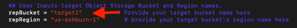
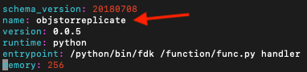
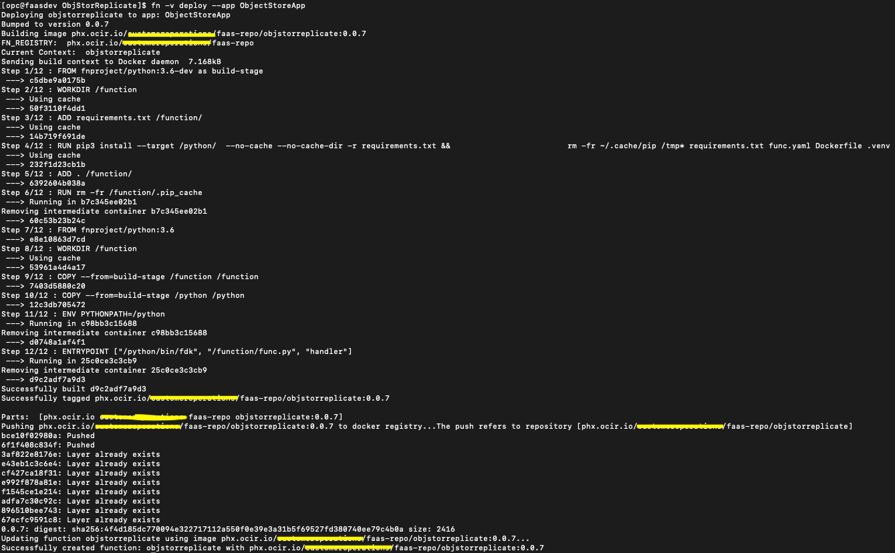
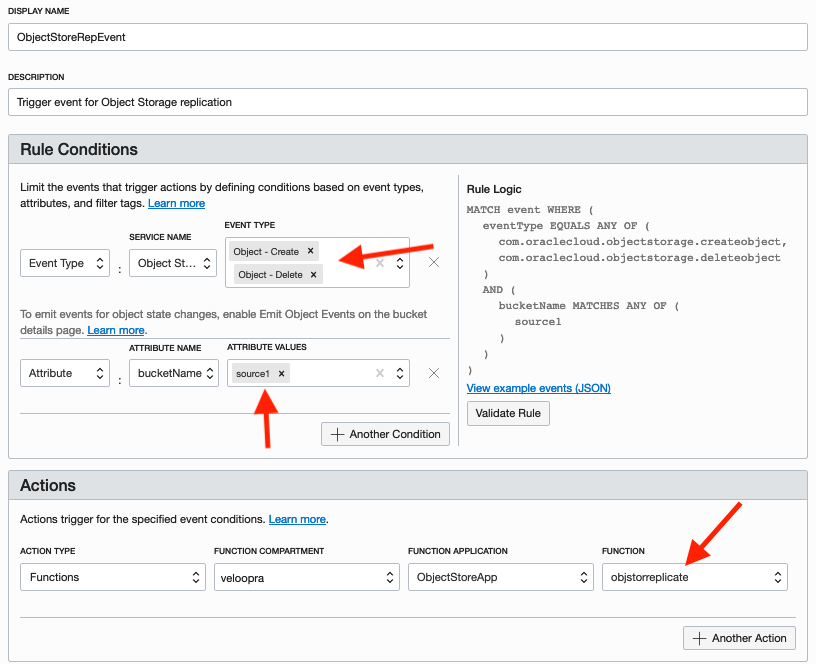
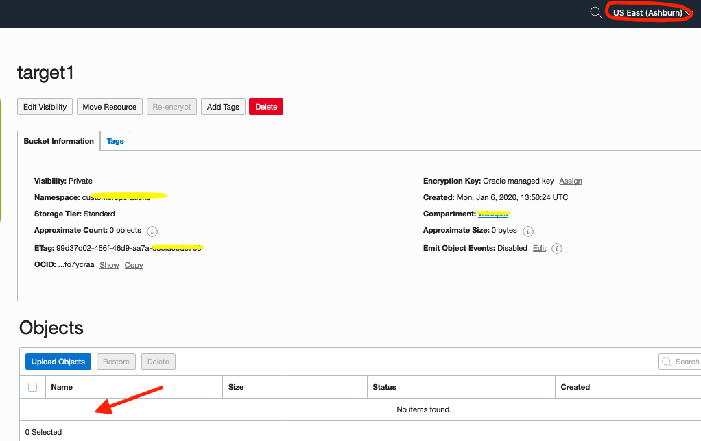

# Serverless Replication Between OCI Object Storage Buckets.

Serverless Function to replicate objects between two OCI Object Storage buckets in the same or different region, by leveraging OCI Event and Function services.

Steps below illustrate the procedure to setup OCI Event and Function service to replicate both object upload and delete operation in a source Object Storage bucket to a target bucket. Here in this example we are configuring replication from a bucket named "source1" in Phoenix OCI region to a bucket named "target1" in Ashburn OCI region. 

Whenever an object is created in "source1" bucket, the same object is replicated to "target1" bucket. When an object is deleted from "source1" bucket the same object will be deleted from "target1" bucket. However, if the requirement is replicate upload operation only(no need to delete from "target1"), we can modify either the function code(func.py) or configure Event service to invoke the Function only for Object-Create events in the "source1" bucket. 

Also the Function code can be modified to implement one to many replication combination, to replicate from one Object Storage bucket to several target buckets.

## Replication Architecrture

   
   

## Implementation Steps.

1. Create an Application of your desired name(Ex: ObjectStoreRep)from OCI console by following:https://docs.cloud.oracle.com/iaas/Content/Functions/Tasks/functionscreatingapps.htm#console

   

2. Setup your tenancy for OCI Function development and configure your local PC/Laptop/VM for OCI Function development by following: https://docs.cloud.oracle.com/iaas/Content/Functions/Tasks/functionsconfiguringtenancies.htm https://docs.cloud.oracle.com/iaas/Content/Functions/Tasks/functionsconfiguringclient.htm

3. Clone/Download this(https://github.com/sherinchandy/oci-objectstorage-replication) github repo into your local directory. 

   

   

4. Edit the file "func.py" and update it with the target OCI region name and Object Storage bucket name. 

   

5. Edit the file "func.yaml" and specify your preferred name(Ex: name: objstorreplicate) for the OCI Function.

   

6. Deploy the function to OCI Function service. This step should push the Function image to OCIR service and attach the function to the OCI Function service Application created in step 1.

   

7. Verify that you are now able to see the Function created in previous step is appearing in the OCI Function service Application's console.

   

8. Create an Event rule in Event service to generate an event for object upload and delete operation in the source Object Storage bucket. We can use "Object-Create" and "Object-Delete" as event types and source bucket name as event attribute and the Function created in step 6 as Action item. Reference: https://docs.cloud.oracle.com/iaas/Content/Events/Concepts/eventsgetstarted.htm#Console

   

9. Now start uploading objects to the source Object Storage bucket and verify whether the same object is appearing in the target Object Storage bucket specified in step 4. It may take few minutes to replicate the object from source to target bucket based on the object size and whether the target bucket is in the same region as that of source bucket.

 #### Object Upload to Source Bucket
   

#### Verify Same Objects in Target Bucket
   

10. Delete objects from source bucket and verify whether the same objects are disappearing from target bucket also.

#### Delete Objects from Source Bucket   
   

#### Verify Deletion of Objects in Target Bucket
   
